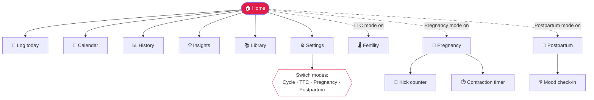
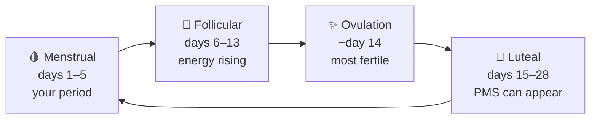
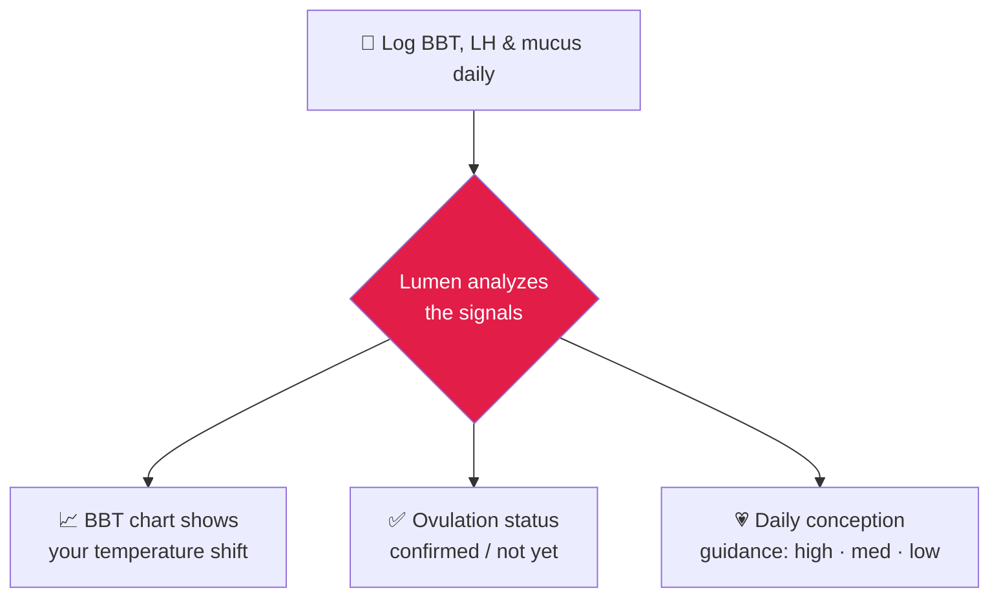
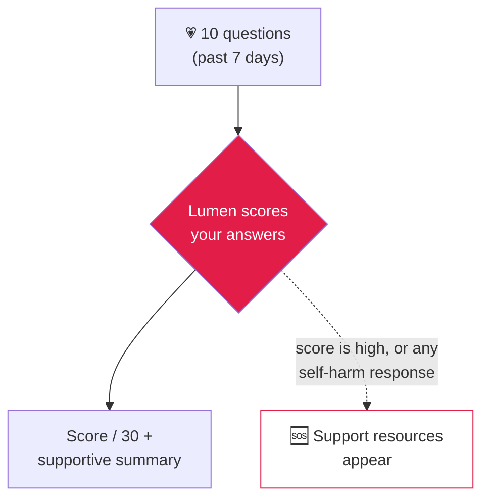
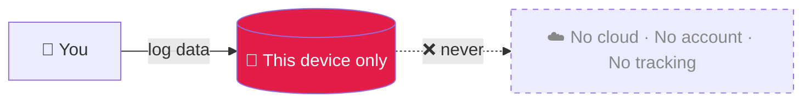

# Lumen — User Guide

> **Lumen** is a private, offline‑first period, fertility, pregnancy, and postpartum tracker. Everything you log stays **on your device** — there's no account, no cloud, and no tracking. This guide walks you through every screen so you can get the most out of it.

<p align="center"><em>🌙 Track your cycle · 🤰 Plan or follow a pregnancy · 📚 Learn from cited, plain‑language articles — all in one place.</em></p>

---

## Table of contents

1. [Quick start (60 seconds)](#quick-start-60-seconds)
2. [How Lumen is organized](#how-lumen-is-organized)
3. [First launch & onboarding](#first-launch--onboarding)
4. [The Home screen](#the-home-screen)
5. [Logging your day](#logging-your-day)
6. [Calendar](#calendar)
7. [History & trends](#history--trends)
8. [Insights](#insights)
9. [Library](#library)
10. [Understanding your cycle phases](#understanding-your-cycle-phases)
11. [Trying‑to‑conceive (TTC) mode](#trying-to-conceive-ttc-mode)
12. [Pregnancy mode](#pregnancy-mode)
13. [Postpartum mode](#postpartum-mode)
14. [Your privacy & your data](#your-privacy--your-data)
15. [Install Lumen as an app](#install-lumen-as-an-app)
16. [Troubleshooting & FAQ](#troubleshooting--faq)
17. [Important: medical disclaimer](#important-medical-disclaimer)

---

## Quick start (60 seconds)

| Step | What you do | Where |
|:----:|-------------|-------|
| 1️⃣ | Open Lumen and pick **Track my cycle** (or **I'm pregnant**). | Welcome screen |
| 2️⃣ | Enter the date your **last period started**, then tap **Get started**. | Welcome screen |
| 3️⃣ | Each day, tap **Log today** and record your flow, symptoms, and mood. | Home → Log |
| 4️⃣ | After a cycle or two, check **Calendar**, **Insights**, and **History** for predictions. | Home |

> 💡 **The golden rule:** the more days you log, the smarter and more confident Lumen's predictions become. A minute a day is plenty.

---

## How Lumen is organized

Lumen has one **Home** hub. From there, tiles take you to each screen. Use your browser's **Back** button to return Home (the Library also has a **Home** link).



Lumen works in **four modes**. You're always in one of them. You switch most modes in **Settings**, while **Postpartum** is entered automatically after a birth (see below):

| Mode | For | Turn it on in |
|------|-----|---------------|
| 🩸 **Cycle** (default) | Tracking periods, symptoms, and predictions | On by default |
| 🌱 **TTC** (trying to conceive) | Pinpointing your fertile window with BBT, LH tests & mucus | Settings → *Trying to conceive* |
| 🤰 **Pregnancy** | Week‑by‑week pregnancy, kick counts & contractions | Settings → *Pregnancy* |
| 🤱 **Postpartum** | Recovery + mental‑health support after birth | Automatic when you confirm **Baby arrived** |

---

## First launch & onboarding

The very first time you open Lumen, you'll see a **Welcome** screen. Tell Lumen what you're here for:

```
┌──────────────────────────────────────┐
│  Welcome                             │
│  Let's set things up. This stays     │
│  private on your device.             │
│                                      │
│  ┌───────────────┐ ┌───────────────┐ │
│  │ Track my cycle│ │ I'm pregnant  │ │   ← pick one
│  └───────────────┘ └───────────────┘ │
│                                      │
│  When did your last period start?    │
│  ┌──────────────────────────────────┐│
│  │ 2026-06-18                  📅   ││   ← date picker
│  └──────────────────────────────────┘│
│                                      │
│  ┌──────────────────────────────────┐│
│  │            Get started           ││
│  └──────────────────────────────────┘│
└──────────────────────────────────────┘
```

- **Track my cycle** → enter **when your last period started**. This anchors your first prediction.
- **I'm pregnant** → enter your **due date**. Lumen opens straight into [Pregnancy mode](#pregnancy-mode).

> 💡 Don't remember the exact date? An approximate one is fine — predictions sharpen automatically as you log real periods.

---

## The Home screen

Home adapts to your mode and your most relevant information sits at the top.

```
┌──────────────────────────────────────┐
│  Luteal phase                        │
│        Day 6                         │   ← today's cycle summary
│  Next period in ~22 days             │
│  Confidence: high                    │
│                                      │
│  💡 Insight of the day …             │   ← top insight (tap for more)
│  📚 Daily read: "…"                  │   ← a relevant article
│                                      │
│  ┌────────────┐ ┌────────────┐       │
│  │ Log today  │ │ Calendar   │       │
│  ├────────────┤ ├────────────┤       │
│  │ History    │ │ Settings   │       │
│  ├────────────┤ ├────────────┤       │
│  │ Insights   │ │ Library    │       │
│  └────────────┘ └────────────┘       │
└──────────────────────────────────────┘
```

| Tile | What it does |
|------|--------------|
| **Log today** (pink) | Record today's flow, symptoms, and mood. Your main daily action. |
| **Calendar** | A month view of your past and predicted cycle. |
| **History** | Averages and a list of every cycle. |
| **Insights** | Personalized patterns and gentle flags. |
| **Library** | Cited articles, picked for you. |
| **Settings** | Switch modes, set a passcode, export or delete data. |
| **Fertility** | *Appears only in TTC mode* — your BBT chart and conception guidance. |
| **Pregnancy** | *Appears only in Pregnancy mode* — your week‑by‑week hub. |
| **Postpartum** | *Appears only in Postpartum mode* — your recovery hub and mood check-in. |

The card at the very top changes with your situation:
- **Cycle mode** → current phase, cycle day, and your next‑period prediction with a **confidence** label.
- **TTC mode** → a **conception guidance** card (today's chance: high / medium / low).
- **Pregnancy mode** → your **week, trimester, and countdown to your due date**.
- **Postpartum mode** → your **recovery week and stage**, plus the band of your most recent mood check-in.

---

## Logging your day

Tap **Log today** from Home. Logging takes seconds — tap the chips that apply, then **Save**.

```
┌──────────────────────────────────────┐
│  Log for today                       │
│                                      │
│  Flow                                │
│  (none) (spotting) (light) (medium)  │
│  (heavy)                             │
│                                      │
│  Symptoms                            │
│  (Cramps) (Headache) (Bloating) …    │
│                                      │
│  Mood                                │
│  (Happy) (Calm) (Anxious) …          │
│                                      │
│  Notes                               │
│  ┌──────────────────────────────────┐│
│  │                                  ││
│  └──────────────────────────────────┘│
│  ┌──────────────────────────────────┐│
│  │               Save               ││
│  └──────────────────────────────────┘│
└──────────────────────────────────────┘
```

### What you can record

| Field | Options |
|-------|---------|
| **Flow** | none · spotting · light · medium · heavy |
| **Symptoms** | Cramps · Headache · Bloating · Tender breasts · Acne · Fatigue · Backache · Nausea |
| **Mood** | Happy · Calm · Anxious · Irritable · Sad · Energetic · Mood swings |
| **Notes** | Free text — anything you want to remember |

Tap a chip to select it (it turns **pink**); tap again to deselect. You can pick **multiple** symptoms and moods. Tap **Save** and you'll see a green **Saved** confirmation.

> ⚠️ **How periods are detected:** Logging a **Light**, **Medium**, or **Heavy** flow tells Lumen your period has started, and it automatically begins a new cycle. **Spotting** and **None** do *not* start a cycle. If you log a period flow within a couple of days of your last bleeding day, Lumen treats it as the *same* period continuing — not a new one.

> 💡 **The Log screen always records today.** To see past days, open the **Calendar**.

In **TTC mode** and **Pregnancy mode**, this same screen grows extra fields — see those sections below.

---

## Calendar

A month‑at‑a‑glance view of your cycle. **Today** is marked with a pink ring.

```
┌──────────────────────────────────────┐
│  Calendar                            │
│   ←        June 2026        →        │   ← tap arrows to change month
│   S  M  T  W  T  F  S                 │
│   1  2  3  4  5  6  7                 │
│   …             (23)  24  25 …        │   ← (23) = today, ringed
│                                      │
│  ● Period   ◐ Predicted period       │
│  ● Fertile window   ◉ Ovulation      │   ← legend
└──────────────────────────────────────┘
```

| Marker | Meaning |
|--------|---------|
| ● **Period** | Days you logged a period flow |
| ◐ **Predicted period** | Lumen's estimate of your next period |
| ● **Fertile window** | The days around ovulation when conception is most likely |
| ◉ **Ovulation** | The estimated ovulation day |

- Use **←** / **→** to move between months and reach past cycles or future predictions.
- Jumped away? Tap **Back to this month** to return to today.

---

## History & trends

See your cycle at a higher level. Three summary tiles sit on top, followed by a list of every cycle (newest first).

| Tile | Meaning |
|------|---------|
| **Avg cycle** | Your average number of days from one period to the next |
| **Avg period** | Your average number of bleeding days |
| **Regularity** | **Regular** if your cycles are consistent, **Variable** if they swing |

Each row shows a cycle's start date and its length (e.g. *"28 day cycle"*). Your most recent cycle is labelled **Current cycle** because it isn't finished yet.

> 💡 **Variable** isn't a problem on its own — it just means Lumen widens its prediction range and shows lower confidence until things settle.

---

## Insights

Lumen reads your logs and surfaces plain‑language **insights** — and it's transparent about *why* each one appears. There are four kinds:

| Type | Example |
|------|---------|
| 🔁 **Patterns** | "You often log cramps in your luteal phase." |
| 📈 **Trends** | "Your cycles have been getting a little longer." |
| ⚠️ **Anomalies** | "Your period is a few days overdue compared with your average." |
| 🌿 **Guidance** | Phase‑appropriate self‑care tips. |

Insights are sorted so **attention** items (worth a closer look) appear above general **info**. The single most relevant one is also shown on Home.

> 💡 Seeing *"Keep logging to unlock insights"*? That just means Lumen needs a bit more data. Keep logging and the cards will appear.

> ⚠️ An anomaly flag is **informational, not a diagnosis**. If something worries you, talk to a clinician.

---

## Library

A built‑in collection of **medically cited, plain‑language articles** (sources include the NHS, ACOG, and the Office on Women's Health).

- **For you** — up to three articles picked for your current phase and what you've been logging, each with a short reason for the match.
- **Browse** — every article, with tools to narrow them down:

| Tool | Use |
|------|-----|
| 🔎 **Search articles** | Find by title or summary |
| **All topics** ▾ | Filter by subject |
| **All phases** ▾ | Filter by cycle phase (menstrual · follicular · ovulation · luteal) |

Tap any article to open the full reader. Tap **Home** to go back.

---

## Understanding your cycle phases

Lumen uses four phase names across the Calendar, Insights, and Library. Here's what they mean (lengths vary per person):



| Phase | Roughly when | What's happening |
|-------|--------------|------------------|
| 🩸 **Menstrual** | Days 1–5 | Your period — the bleeding days. |
| 🌱 **Follicular** | Days 6–13 | Hormones rise; many people feel more energetic. |
| ✨ **Ovulation** | Around day 14 | An egg is released — your most fertile time. |
| 🌙 **Luteal** | Days 15–28 | The lead‑up to your next period; PMS symptoms may show up. |

> 💡 All of Lumen's predictions are **deterministic and explainable** — they come from your own logged data with clear math, never from a black‑box guess.

---

## Trying-to-conceive (TTC) mode

Turn this on when you're trying for a baby and want to pinpoint your fertile window.

### Turn it on

1. Go to **Settings → Trying to conceive**.
2. Tap **Turn on TTC mode**.
3. Choose your temperature unit: **°C** or **°F**.

A new **Fertility** tile now appears on Home, and your **Log** screen gains extra fields.

### Extra fields on the Log screen (TTC)

| Field | What to enter |
|-------|---------------|
| **Basal body temperature** | Your waking temperature, taken before getting up |
| **Ovulation test (LH)** | The result of an LH strip: *negative* or *positive* |
| **Cervical mucus** | dry · sticky · creamy · watery · egg‑white |
| **Intercourse** | Tick if applicable; a **Protected** option then appears |

### The Fertility screen



- **BBT chart** — plots your morning temperatures so you can see the post‑ovulation rise.
- **Ovulation status** — confirms ovulation once your logged signals (temperature shift, a positive LH test, egg‑white mucus) line up.
- **Conception guidance** — a simple read on today's chances.

> 💡 After several cycles of tracking, Lumen may gently suggest talking to a healthcare provider — this is common and supportive, not a warning.

> ⚠️ **Lumen is not a contraceptive** and is not a substitute for fertility treatment or medical advice.

---

## Pregnancy mode

Follow your pregnancy week by week, with a kick counter and contraction timer built in.

### Turn it on

Go to **Settings → Pregnancy** and choose how to start:

| Option | When to use it |
|--------|----------------|
| **Enter my due date** | You already know your estimated due date |
| **Enter my last period date (LMP)** | Lumen calculates the due date for you |
| **Use my last logged period** | Reuse a period you already logged in Lumen |

Tap **Start pregnancy mode**. (You can also choose **I'm pregnant** during first‑time onboarding.)

### The Pregnancy hub

The **Pregnancy** tile opens your hub:

- A header card with your **current week, trimester, and a countdown to your due date**.
- **Baby this week** — fetal development highlights.
- **Your body this week** — what to expect for you.
- **Sources** for the week's information, plus quick links:

| Link | What it opens |
|------|---------------|
| 👣 **Kick counter** | Count your baby's movements |
| ⏱️ **Contraction timer** | Time contractions during labor |
| 📝 **Log symptoms** | The daily log, with pregnancy‑specific symptoms added |
| ⚙️ **Manage pregnancy** | Edit your due date or end pregnancy mode |

> 💡 In pregnancy mode, the Log screen adds symptoms like *Heartburn, Swelling, Round ligament pain, Braxton Hicks,* and *Pelvic pressure*. Cycle‑only content (period/PMS material) is hidden so it stays relevant.

### Kick counter

1. Tap **Start a session**.
2. Tap **Record a kick** each time you feel movement. The counter climbs toward the daily target of **10**.
3. Tap **Finish** to save. Past sessions are listed below.

> ⚠️ Counting movements is informational. **Contact your provider if you notice reduced movement.**

### Contraction timer

1. Tap **Start contraction** when one begins, **Stop contraction** when it ends.
2. Repeat for each contraction. Lumen watches for the well‑known **5‑1‑1 pattern** (contractions ~5 minutes apart, lasting ~1 minute, for ~1 hour) and shows an alert when that pattern appears.
3. Tap **Save session** to keep a record.

> ⚠️ The timer is **informational only and does not diagnose labor.** Follow your provider's guidance.

### When your pregnancy ends

Under **Settings → Pregnancy → Manage pregnancy**, you can tell Lumen your pregnancy has ended:

- **Baby arrived** 🎉 — Lumen congratulates you and switches into [**Postpartum mode**](#postpartum-mode) to support your recovery. You can return to cycle tracking whenever you're ready.
- **My pregnancy has ended** 🤍 — Lumen responds with a **compassionate, no‑pressure** screen: no celebratory messaging, no period prompts, and links to support. You return to cycle mode only when *you* choose to. (This path never enters postpartum mode.)

---

## Postpartum mode

Postpartum mode is a recovery‑focused home for the weeks after birth. Instead of dropping you straight back into period tracking, it supports your **physical recovery and mental health** with week‑by‑week guidance, a validated mood check‑in, and gentle recovery logging.

> 💙 Postpartum mode is **about you, the mother** — not a baby tracker. It doesn't log feeds, diapers, or baby sleep.

### How you get here

Postpartum mode turns on **automatically** when you confirm **Baby arrived** under *Settings → Pregnancy → Manage pregnancy* (or in the Pregnancy hub). Lumen anchors a recovery clock to your **birth date** and opens a recovery space. There's no manual toggle to start it — it always follows a birth.

> 🤍 The **pregnancy‑loss** path never enters postpartum mode. It stays on its own compassionate screen and returns to cycle tracking only when you choose.

### The Postpartum hub

A **Postpartum** tile appears on Home and in the nav. It opens your hub:

- A header card showing **Postpartum · week N** and your **recovery stage**:
  | Stage | Roughly when |
  |-------|--------------|
  | **Early recovery** | Weeks 0–6 (the acute phase) |
  | **Recovering** | Weeks 6–12 |
  | **Ongoing recovery** | 12 weeks onward |
- **This week's focus** — plain‑language recovery notes covering bleeding (lochia), perineal/C‑section healing, afterpains, night sweats, pelvic floor, sleep, mood, and feeding.
- **When your cycle returns** — an honest note that periods can take weeks to many months to come back, that breastfeeding can delay them, and that **Lumen will not guess a date**.
- Quick links: **Mood check‑in**, **Log recovery**, and **Manage postpartum** (Settings).
- **Sources** for the week's content (NHS, ACOG, Office on Women's Health) and an educational‑only disclaimer.

> 💡 Recovery content runs through about week 12; after that, the hub keeps showing the "three months and beyond" guidance.

### The mood check‑in (EPDS)

The heart of postpartum mode is a **mood check‑in** based on the **Edinburgh Postnatal Depression Scale (EPDS)** — a widely used, validated screening questionnaire.

1. From the hub, tap **Mood check‑in**.
2. Answer **10 short questions** about how you've felt **over the past 7 days**.
3. Tap **See my result** to get your **score out of 30** and a supportive, plain‑language reading.



| Score | What Lumen shows |
|-------|------------------|
| **Under 10** | Lower range |
| **10–12** | Some symptoms — worth sharing with your provider |
| **13 or more** | Please reach out to your provider |

Every result carries the same reminder: **this is a screening tool, not a diagnosis — please share it with your healthcare provider.**

> 🆘 If your score is high **or** you give any answer above zero to the question about thoughts of harming yourself, Lumen shows a prominent **"Support is available"** block: contact your provider, call a crisis or mental‑health line in your area, and contact emergency services if you're in immediate danger. The guidance is region‑agnostic (it names the *kind* of help, not a specific number, so it's never out‑of‑date or wrong‑country).

Your past check‑ins are saved and listed under *Settings → Postpartum*.

### Logging your recovery

In postpartum mode, **Log recovery** swaps in postpartum‑specific fields:

| Field | Options |
|-------|---------|
| **Lochia (bleeding)** | none · spotting · light · medium · heavy |
| **Symptoms** | Afterpains · Perineal pain · C‑section pain · Breast pain · Engorgement · Sore nipples · Night sweats · Constipation · Hemorrhoids · Fatigue · Back pain · Hair loss |
| **Mood** | Happy · Calm · Bonding · Anxious · Overwhelmed · Tearful · Irritable · Sad · Numb · Guilty |

> ⚠️ **Lochia is recorded separately from period flow.** Postpartum bleeding never feeds your cycle stats or predictions — it's kept apart so your recovery and your cycle history don't get tangled.

### Manage postpartum & moving on

Under **Settings → Postpartum** you can:

- Mark **I am breastfeeding** — this tunes the educational copy only and is **never** used as a prediction input.
- **Edit your birth date** if the recovery clock needs adjusting.
- Review your **mood check‑in history**.
- **End postpartum mode** when you're ready, choosing where to go next:
  - **Back to cycle tracking**
  - **Start trying to conceive** (TTC mode)

Exit is entirely **your choice** — Lumen never predicts when your cycle will return and never nags you to move on.

---

## Your privacy & your data

Privacy is Lumen's headline promise.



- **Local‑first.** Everything you log lives in your browser on this device. Lumen never uploads it.
- **No account, no ads, no tracking SDKs.** Nothing to sign up for.

Manage everything under **Settings → Your data**:

| Action | What happens |
|--------|--------------|
| **Export my data** | Downloads a single JSON file with everything you've logged — your backup. |
| **Delete all data** | Permanently erases everything on this device. You'll confirm with **Yes, delete**. This cannot be undone. |

### Optional passcode lock

Under **Settings → Passcode lock**, set a **numeric passcode** to gate the app on this device.

- Tap into the field, enter digits, and tap **Set passcode**.
- To remove it later, tap **Remove passcode**.

> ⚠️ The passcode is an **app‑level gate**, not encryption. The local database itself is not encrypted, so it's one layer of privacy — not a vault. Keep your device secured too.

> 💡 Because your data is device‑local, it doesn't sync across phones or browsers. Use **Export my data** before switching devices or clearing your browser.

---

## Install Lumen as an app

Lumen is a **Progressive Web App (PWA)** — you can install it to your home screen and use it offline.

| Device | How |
|--------|-----|
| **Android / Chrome** | Open the menu (⋮) → **Install app** / **Add to Home screen** |
| **iPhone / Safari** | Tap **Share** → **Add to Home Screen** |
| **Desktop** | Click the **install icon** in the address bar |

Once installed, Lumen launches full‑screen with its crescent‑moon icon and works **without a connection** — your data is already on your device.

---

## Troubleshooting & FAQ

<details>
<summary><strong>I don't see any predictions or insights yet.</strong></summary>

Lumen needs at least one logged period to start predicting, and a cycle or two before insights and confidence improve. Keep logging — it gets smarter quickly.
</details>

<details>
<summary><strong>My period is longer than usual — did Lumen start a new cycle by mistake?</strong></summary>

No. Lumen anchors to your last bleeding day, so a period that runs longer than your average stays part of the *same* cycle rather than being split into a new one.
</details>

<details>
<summary><strong>How do I log a day I missed?</strong></summary>

The **Log today** screen always records today. Browse the **Calendar** to review past days.
</details>

<details>
<summary><strong>I switched phones / cleared my browser and my data is gone.</strong></summary>

Data is stored only on the device where you logged it and isn't backed up to any cloud. Always **Export my data** first, then keep that JSON file safe.
</details>

<details>
<summary><strong>How do I switch between cycle, TTC, pregnancy, and postpartum modes?</strong></summary>

*Trying to conceive* and *Pregnancy* each have a toggle/start button in **Settings**; turning a mode off returns you to standard cycle tracking. **Postpartum** mode is the exception — it isn't a manual toggle. It starts automatically when you confirm **Baby arrived** in the pregnancy end flow, and you leave it from *Settings → Postpartum* (back to cycle, or into TTC).
</details>

<details>
<summary><strong>Is the postpartum mood check‑in a diagnosis?</strong></summary>

No. It's a **screening tool** (the Edinburgh Postnatal Depression Scale) that gives you a score and a supportive summary. It is not a diagnosis — always share your result with your healthcare provider, and use the on‑screen support resources if you're struggling.
</details>

<details>
<summary><strong>Is my data safe if I lose my phone?</strong></summary>

Set a **passcode** (Settings → Passcode lock) for an app‑level gate, and rely on your device's own lock screen. Remember the local database isn't encrypted, so device security matters.
</details>

---

## Important: medical disclaimer

> Lumen provides **estimates and educational information only**. It is **not medical advice**, not a contraceptive, and not a substitute for professional care. Predictions are based on the data you enter and can be wrong. Always consult a qualified healthcare provider with any health concerns or before making decisions about contraception, conception, pregnancy, or treatment.

---

<p align="center"><em>Made for tracking that respects your privacy. 🌙</em></p>
